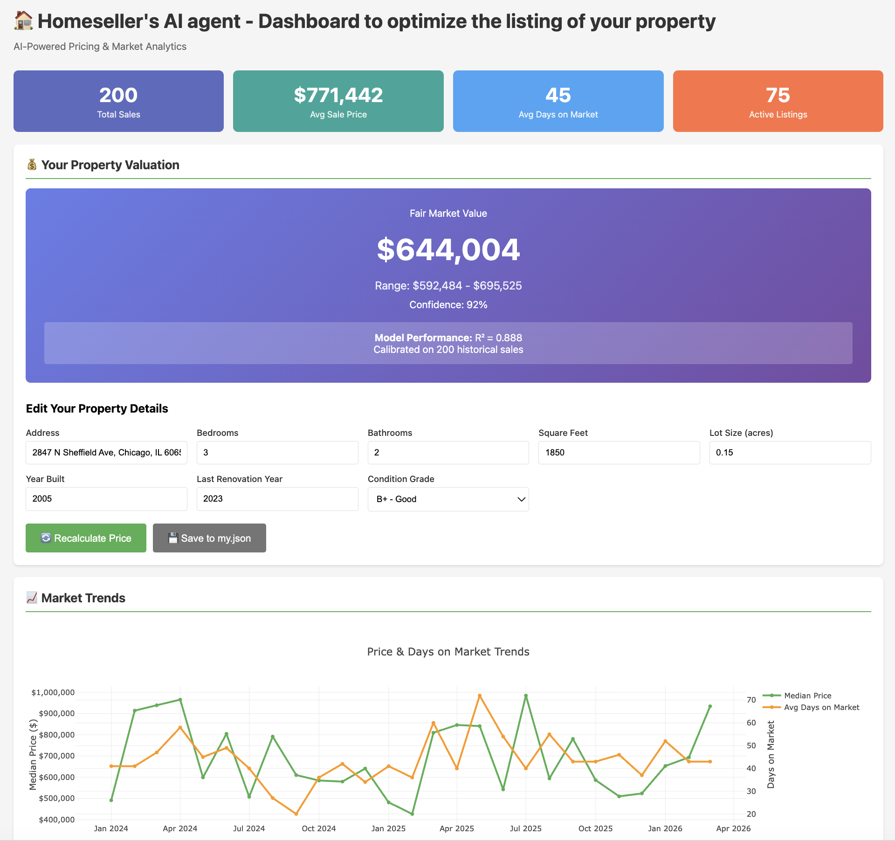
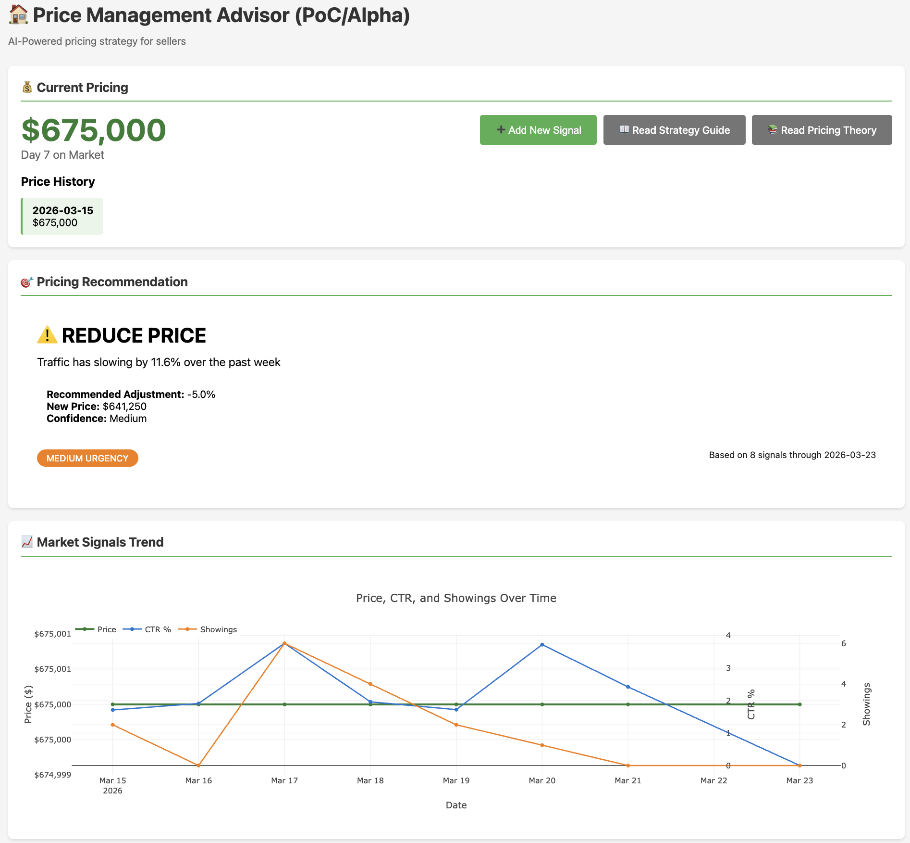

# Real Estate Price Management solutions

AI/ML-powered tools to help homeowners smartly price and sell their homes
(STATUS: proof of concept - limited testing)

The solution is ideal for tech-savvy and independent sellers, including FSBO (for sale by owner)

## Listing advisor



## Price management advisor


## Contact

- [contact@optanomai.8shield.net](contact@optanomai.8shield.net)
- More about [optanom.ai](https://optanom.ai/)

## Quick start

### 1. Price planner (utilize before listing)

```bash
uv run python price_planner.py
```

Open http://localhost:8080 in your browser (do not include index.html in the path)

### 2. Price management advisor (utilize after listing)

```bash
uv run python price_adjust_manager.py
```

Open http://localhost:8081 in your browser to view.


### 3. Pricing chatbot (conversational advisor)

```bash
uv run python price_chatbot.py
```

Open http://localhost:8084 in your browser.

Requires AWS credentials (auto-detected from `AWS_PROFILE` if set).

### 4. Get Real Estate Data

Modify ```my.json``` to describe your property (or use the listing advisor)

For comparables and market signals, you have two options:

#### Option A: Use Sample Generated Data (for testing)
```bash
uv run python data_gen.py
```

This creates synthetic sales and listings data in `data-generated/`:
- `ATTOM-sales.json` - Historical sales records
- `ATTOM-listings.json` - Current active listings
- `my_signals.jsonl` - Daily market signals timeline for your listing

#### Option B: Use Real Market Data (recommended)

For production use, obtain real market data through:

1. **Web Scraping**: Build scrapers for public real estate sites (Zillow, Realtor.com, Redfin)
   - Use tools like Scrapy, BeautifulSoup, or Playwright
   - Respect robots.txt and rate limits
   - Note: May violate terms of service - check legal requirements

2. **Commercial Data Providers**:
   - **ATTOM Data Solutions** (https://www.attomdata.com) - Property data API
   - **CoreLogic** - MLS and property records
   - **Zillow API** - Limited free tier available
   - **Realtor.com API** - Property listings
   - **DataTree** - Property and ownership data

3. **MLS Access**: 
   - Contact local Multiple Listing Service (MLS)
   - Requires real estate license or partnership
   - Most comprehensive and accurate data

4. **Public Records**:
   - County assessor offices
   - Recorder of deeds
   - Free but requires manual collection

Save data in the same JSON format as the generated samples.

## Detailed features

### Data Generation (`data_gen.py`)
Comprehensive parameter system for generating realistic real estate data:
- **Time Window**: Date ranges, listing creation rates
- **Property Stock**: Type, size, age, condition distributions
- **Economic Trends**: Mortgage rates, market velocity, appreciation
- **Pricing Behavior**: Pricing strategies, sale outcomes
- **Market Dynamics**: Days on market, competition, seasonality
- **Geographic**: Locations, zip-code pricing

### Dashboard (`price_planner.py`)
Interactive web interface with:
- **Market Statistics**: Total sales, average prices, days on market
- **Your Property Valuation**: ML-powered price prediction for your FSBO listing
- **Market Trends Chart**: Time series of prices and days on market
- **Sortable Tables**: Click column headers to sort
- **Filterable Data**: Search by address, filter by bedrooms/price
- **Pricing Model**: Linear regression calibrated on historical sales

### Price Management Advisor (`price_adjust_manager.py`)
AI-powered pricing strategy tool that:
- **Analyzes Market Signals**: Tracks digital engagement (CTR, impressions, saves) and physical interest (showings, second showings)
- **Traffic Trend Analysis**: Monitors 7-day trends to detect declining, stable, or increasing buyer interest
- **Pricing Recommendations**: Provides actionable advice (reduce price, hold, or monitor) with confidence levels
- **Price History Tracking**: Visualizes all price adjustments and their impact on market signals
- **Interactive Charts**: Real-time visualization of price, CTR, and showing trends
- **Urgency Indicators**: Flags high-urgency situations requiring immediate price adjustments

### Price Management Advisor (`price_chatbot.py`)
Conversational AI wizard to help plan listing price and adjust it, powered by Amazon Bedrock, informed by professional guidance. 
-- **Versatile input**: supports copying and pasting data
-- **Future**: integrate with other components and deploy with Amplify

### Your Listing (`my.json`)
Edit this file with your property details to get a fair market price estimate.

## Customization

Edit configuration in `data_gen.py`:
```python
config = DataGenerationConfig(
    time_window=TimeWindowConfig(start_date="2024-01-01"),
    economic_trends=EconomicTrendsConfig(market_velocity="HOT"),
    num_sales=500,
    # ... more parameters
)
```

## Future Work

- **AI agent for constructing listing**: AI-powered photo selection and description writing
- **Enhanced pricing ML models**: Implement XGBoost, Random Forest, and ensemble methods
   - Location-specific features (school ratings, crime rates, walkability)
   - Market timing factors (seasonality, interest rates, inventory levels)
   - Property-specific amenities (pool, garage, fireplace, etc.)
   - Neighborhood trends and comparable sales analysis
   - More sophisticated models (XGBoost, Random Forest, Neural Networks)
   - Time-series forecasting for price trends
- **Advanced Dynamic Pricing**: More advanced AI-powered price recommendations 
   - Price Elasticity: Model demand curves for optimal pricing
   - Comparative Market Analysis: Automated CMA reports
   - End-to-end revenue optimization: consider holding cost and market risks
- **Integration**: Connect to real MLS data APIs and CRM systems
- **Mobile App**: iOS/Android apps for on-the-go management
